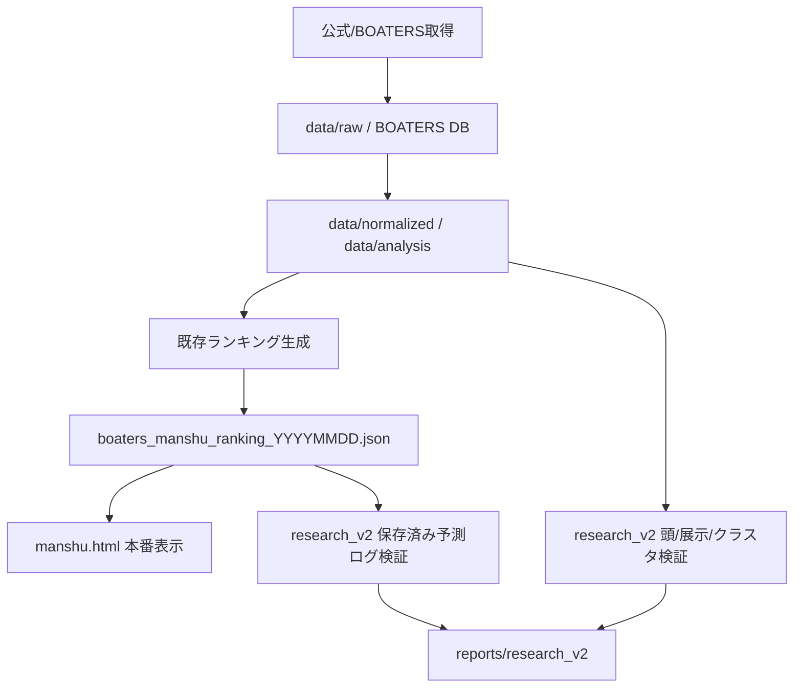

# research_v2 Current System Audit

この監査は、本番ツールを変更せずに既存コード・保存済みJSON・出力ファイルを読んで作成したものです。

- 監査時刻: 2026-06-25T10:50:16+09:00
- Git commit: `211d1fa686ed356bacf489638908beaedbd5bbf4`
- Git status entries: 1

## 判定サマリ

| 項目 | 判定 | 根拠 |
| --- | --- | --- |
| 現在の万舟率ランキング生成 | 実装済み | `rank_daily_manshu_candidates.py` と保存済み `boaters_manshu_ranking_YYYYMMDD.json` が存在。 |
| 頭候補、軸候補、消し候補 | 実装済み | `build_boat_role_dataset.py` の `head/axis/toss/opponent` とフォーメーションA-Dが存在。 |
| 朝版と直前版 | 実装済み | role dataset に `morning` / `preview` が存在。 |
| 展示タイム | 実装済み | 正規化データとrole datasetに `exhibition_time` が存在。 |
| 展示ST | 実装済み | 正規化データに `exhibition_st` が存在。 |
| 1周タイム | 実装済み | BOATERS側ランキングメトリクスに `isshu` 系が存在。公式正規化データには限定的。 |
| 周回、回り足、直線 | 一部実装 | 現在の公式正規化データには明確な列なし。BOATERS側由来は一部メトリクスのみ。 |
| チルト | 一部実装 | `tilt` 列はあるが、現データでは取得率0%に近い。 |
| スリット隊形 | 実装済み | `rank_daily_manshu_candidates.py` にスリット隊形補正が存在。 |
| 天候、風、波 | 実装済み | 正規化データに `weather/wind/wave` が存在。 |
| オッズ | 実装済み | 取得スクリプトは `odds3t` 対応。ただし保存済み分析データでの継続利用は限定的。 |
| バックテスト | 実装済み | `backtest_role_formations.py` と `backtest_boaters_composite_buy_strategies.py` が存在。 |
| 18点フォーメーション | 実装済み | 既存Bフォーメーションは概ね18点相当。ただしレースごとに重複除外で変動しうる。 |
| 回収率 | 実装済み | 既存に参考回収率あり。今回research_v2で会計式を明示して再計算対象。 |
| 最大連敗 | 一部実装 | `generate_manshu_role_ranking.py` に既存検証値の定数あり。汎用集計はresearch_v2で追加対象。 |
| 最大ドローダウン | 一部実装 | `generate_manshu_role_ranking.py` に既存検証値の定数あり。汎用集計はresearch_v2で追加対象。 |
| 前向き検証 | 一部実装 | 保存済み日別ランキングJSONは5/1以降の前向きログとして扱える。欠落日は後ろ向き扱い。 |
| 特徴量重要度 | 一部実装 | 専用出力は未確認。research_v2で追加対象。 |
| クラスタリング | 未実装 | 専用出力は未確認。research_v2で追加対象。 |
| 追加データの継続保存 | 実装済み | `fetch_boatrace_data.py` と `normalize_boatrace_data.py` があるが、追加候補全体は未整備。 |

## 監査対象ファイル

- `manshu.html`: あり
- `manshu_chokuzen.html`: あり
- `scripts/rank_daily_manshu_candidates.py`: あり
- `scripts/build_manshu_dataset.py`: あり
- `scripts/build_boat_role_dataset.py`: あり
- `scripts/generate_manshu_role_ranking.py`: あり
- `scripts/backtest_role_formations.py`: あり
- `scripts/backtest_boaters_composite_buy_strategies.py`: あり
- `scripts/fetch_boatrace_data.py`: あり
- `scripts/normalize_boatrace_data.py`: あり
- `scripts/validate_manshu_model.py`: あり
- `data/analysis/race_dataset.csv`: あり
- `data/analysis/boat_role_dataset.csv`: あり
- `data/model/manshu_condition_combo_search.csv`: あり
- `.github/workflows/boaters-ntfy-monitor.yml`: あり

## workflow

- `.github/workflows/boaters-ntfy-monitor.yml`

## データフロー図

## 重要な監査結論

- 現行本番ランキングは保存済みJSONを公開ページが読む構成であり、今回の研究ではこのJSONを変更しない。
- `boaters_manshu_ranking_YYYYMMDD.json` と `boaters_manshu_ranking_codex_YYYYMMDD.json` は、存在する日について本番当時の予測記録として扱う。
- 予測時点にない結果列、払戻、人気、決まり手は特徴量に入れない。評価ラベルとしてのみ使用する。
- 展示系は既に一部入っているが、朝版と直前版の増分効果を独立に評価する仕組みは不足している。
- 回収率は既存に参考値があるが、今回のresearch_v2で会計式・返還欠損ルール・ドローダウンを明示して再集計する。
